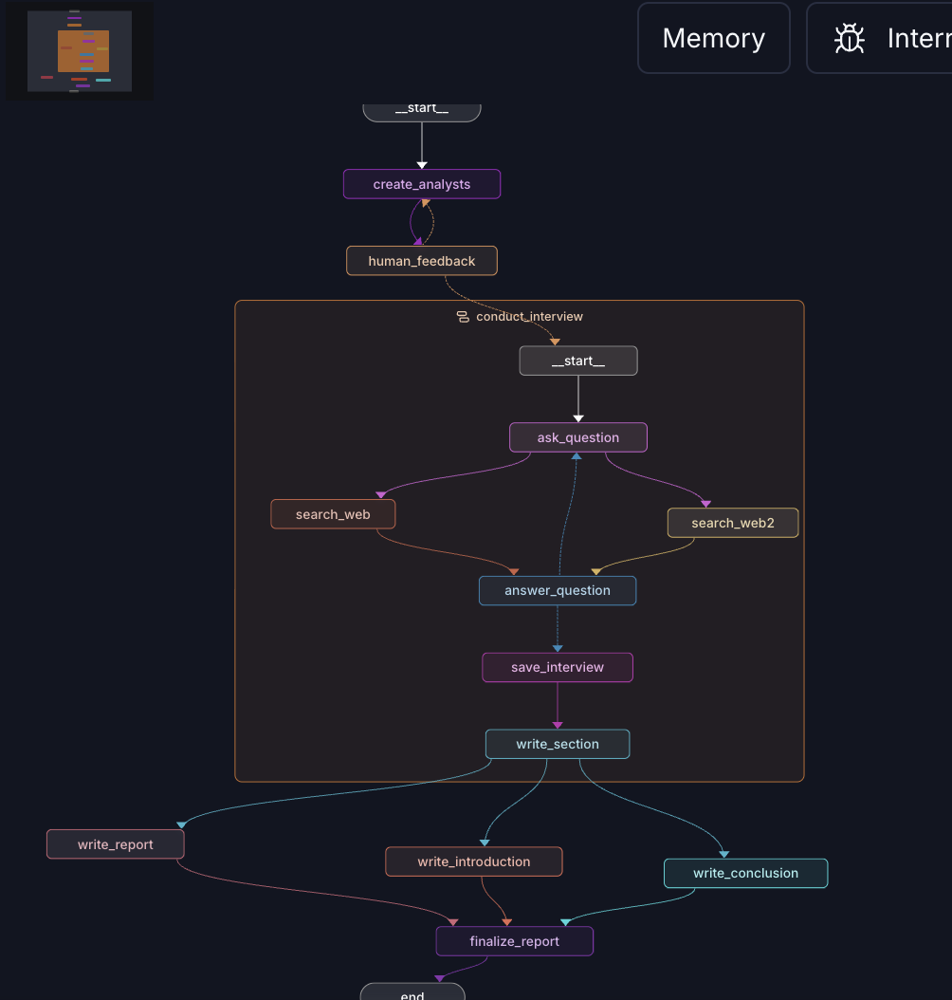

# LangGraph Research Agent

An autonomous multi-agent research system built with [LangGraph](https://github.com/langchain-ai/langgraph) that generates AI analyst personas, conducts web-based interviews, and produces a structured research report — all with human-in-the-loop feedback.

## Graph Architecture



## How It Works

The system is split into three cooperating graphs:

### 1. `create_analysts` — Analyst Generation

- Takes a research **topic** and a desired number of analysts (`max_analysts`)
- Uses GPT-4o to generate distinct AI analyst personas, each with a unique role, affiliation, and focus area
- Pauses via an **interrupt** to let you review and optionally refine the analysts before proceeding
- Loops back to regenerate if you provide feedback, or continues when you approve

### 2. `question_answer_graph` — Interview Subgraph

For each analyst, this subgraph runs an automated interview loop:

| Node                         | What it does                                                 |
| ---------------------------- | ------------------------------------------------------------ |
| `ask_question`               | Analyst generates a targeted question based on their persona |
| `search_web` / `search_web2` | Two parallel Tavily web searches to gather source material   |
| `answer_question`            | Expert persona answers using retrieved context               |
| `save_interview`             | Serialises the full conversation transcript                  |
| `write_section`              | Writes a structured markdown memo from the interview         |

The loop continues until `max_num_turns` expert responses are reached, then exits.

### 3. `research_agent` — Orchestrator

- Spawns a `conduct_interview` subgraph instance for **each analyst in parallel** using LangGraph's `Send` API
- Once all interviews are done, runs three nodes in parallel:
  - `write_report` — consolidates all analyst memos into a single narrative
  - `write_introduction` — writes a compelling intro with a title
  - `write_conclusion` — writes a crisp conclusion
- `finalize_report` assembles everything into the final markdown report

## Project Structure

```
langraph-agent/
├── src/
│   ├── create_analysts.py       # Analyst generation graph
│   ├── answering_questions.py   # Interview subgraph
│   ├── agent.py                 # Main research orchestrator graph
│   └── utils/
│       ├── nodes.py             # All node functions
│       ├── edges.py             # Conditional edge functions
│       ├── states.py            # TypedDict state definitions
│       ├── objects.py           # Pydantic models (Analyst, Perspective, SearchQuery)
│       ├── prompts.py           # All prompt templates
│       ├── models.py            # LLM initialisation
│       └── tools.py             # Tool definitions
├── langgraph.json               # LangGraph server config
├── pyproject.toml
└── .env                         # API keys (not committed)
```

## Setup

**Requirements:** Python 3.14+, [uv](https://docs.astral.sh/uv/)

1. Clone the repo and install dependencies:

   ```bash
   uv sync
   ```

2. Create a `.env` file with your API keys:

   ```env
   OPENAI_API_KEY=sk-...
   TAVILY_API_KEY=tvly-...
   LANGSMITH_API_KEY=lsv2-...   # optional, for tracing
   ```

3. Start the LangGraph dev server:

   ```bash
   uv run langgraph dev
   ```

4. Open LangGraph Studio at the URL printed in the terminal and run the `research_agent` graph with:
   ```json
   {
     "topic": "The impact of AI on software engineering",
     "max_analysts": 3
   }
   ```

## Key Technologies

- [LangGraph](https://github.com/langchain-ai/langgraph) — stateful multi-agent orchestration
- [LangChain OpenAI](https://github.com/langchain-ai/langchain) — GPT-4o for generation
- [Tavily](https://tavily.com/) — real-time web search
- [LangGraph Studio](https://smith.langchain.com/studio) — visual graph debugging
